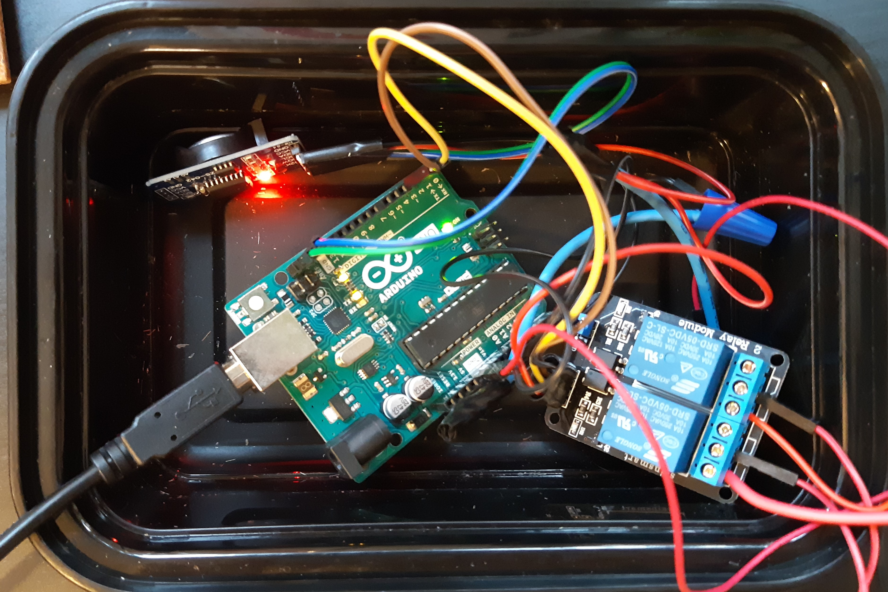

Machambas irrigation controller

Code for a automatic watering of my (very small) machambas. It is a very simple set-up to turn on one or more water pumps at a specific time to water my plants . It kept my plants alive for multiple trips back in the day travelling was still a thing.

### Hardware:

 - Arduino Uno
 - SainSmart 2 channel relay module
 - RTC DS3231 AT24C32 IIC module (under development)
 - 2X 12V water pumps